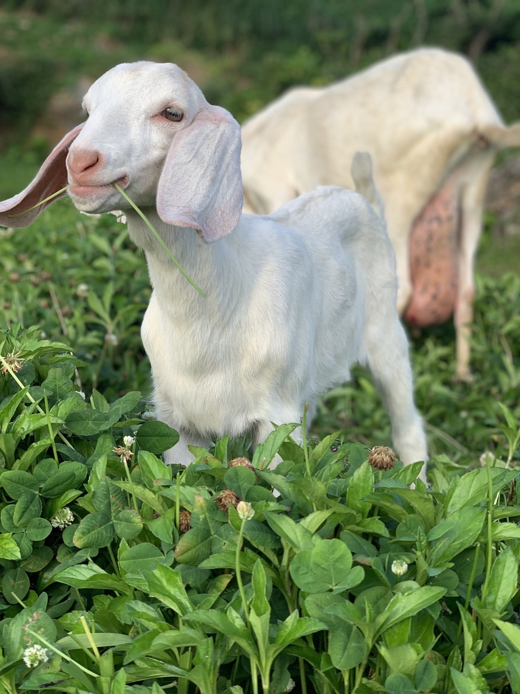

  

<!--h1 without bottom border-->

  <ul align="center">
    
<h1 style="display: inline-block">Hi 👋, I'm HrOkiG2</h1>

  </ul>

<!--h2 without bottom border-->

  <ul align="center">
    
<h2 style="display: inline-block">Apprentice engineer for life.</h2>

  </ul>

<!--Intro start-->
- 🔭 I’m currently working on **AWS, Linux, PHP, TypeScript, MySQL**

- 🌱 I’m currently learning **Learning English. But Slowly.**

- ☁️ I've keen interest in cloud computing. So,I'm learning **AWS**

- 📝 I regularly write articles on [エンジニア見習い](https://otonan-syusyoku.work)

- 💬 Ask me about **AWS, PHP, Laravel, CakePHP, MySQL**
<!--Intro end-->

<!--h1 without bottom border-->

  <ul align="center">
    
<h2 style="display: inline-block">Technologies That I Know👨🏻‍💻</h2>

  </ul>

<!--tech stack icons-->

  

<!--- stats & Trophy (start) -->

  <!--- stats (start) -->
<table align="center">
<tr border="none">
<td width="50%" align="center">
  
  
    
   
</td>

<td width="50%" align="center">

  
  
  </td>
</tr>
    <tr>
        <td>
            
        </td>
        <td>
            
        </td>
    </tr>
</table>
<!--- stats (end) -->

<!--- trophy (start) -->

  

<!--- trophy (start) -->

        
<!--- stats (end) -->

<!--profile visit count-->

  

  

Last Edited on: 7/10/2024
